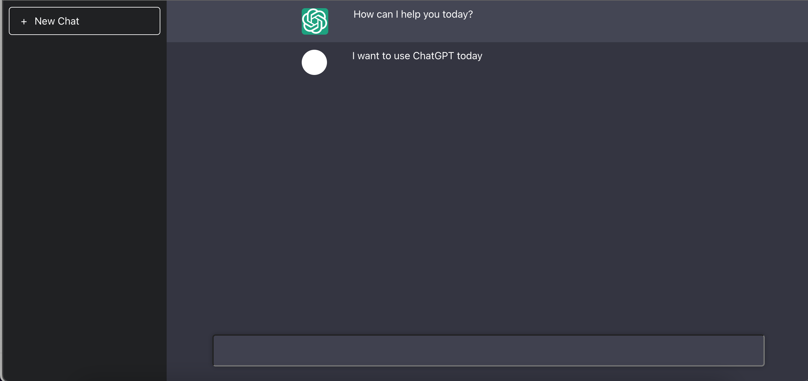

# Enhanced ChatGPT Using RectJS and Node.js

  

## About

In this project, one is learning how to use React.js and Node.js to enhance the ChatGPT application. ChatGPT is a chatbot that utilizes natural language processing to provide conversational responses to user input.React.js is used to build the front-end interface for the chatbot, allowing users to easily interact with the bot and view its responses. Node.js is used for the back-end server, handling requests from the client and processing the chatbot's responses.

By integrating these technologies, the ChatGPT application can be enhanced with new features such as user authentication, chat history storage, and real-time notifications. Users can securely login and access their chat history, which is stored in a database on the server. They can also receive instant notifications when new messages are received, providing a seamless and responsive user experience.

What you will learn:
- How to integrate the ChatGPT API into a React.js application, allowing users to interact with the chatbot in real-time.
- How to build a Node.js server that can handle incoming requests from the client and send responses back to the chatbot.
- How to implement authentication and authorization for the chatbot, ensuring that only authorized users can interact with the bot.

Overall, this project provides a great opportunity to learn and apply key skills in React.js and Node.js, while also enhancing the functionality and user experience of the ChatGPT application.